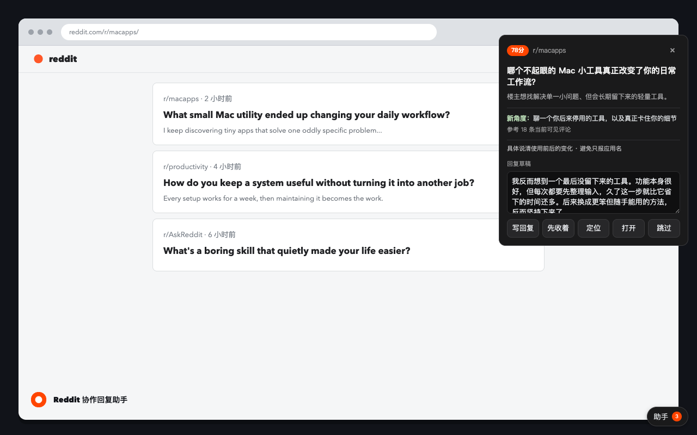

# Reddit 协作回复助手

帮助中文用户发现值得参与的 Reddit 讨论，理解上下文并准备可编辑的回复草稿；最终判断、修改和发送始终由用户完成。

[产品官网](https://evilirving.github.io/reddit-reply-helper/) · [安装说明](https://evilirving.github.io/reddit-reply-helper/install.html) · [隐私说明](https://evilirving.github.io/reddit-reply-helper/privacy.html) · [支持](https://evilirving.github.io/reddit-reply-helper/support.html)

## 能做什么

- 在浏览时发现值得参与的讨论，提供中文理解、回复角度和一条可编辑草稿。
- 支持暂存、跳过、定位和打开讨论，帮助你按自己的节奏决定是否参与。
- 在你选择使用 AI 服务并确认同意后，协助生成内容与翻译；不会自动评论、发帖或投票。

## 安装

在 [安装包页面](https://github.com/EvilIrving/reddit-reply-helper/releases) 下载适合浏览器的版本，并按照[安装说明](https://evilirving.github.io/reddit-reply-helper/install.html)完成安装。

## 隐私与关系说明

你选择使用 AI 服务时，完成该功能所需的文本会发送给你选择的服务；你可以在设置中决定是否启用。阅读设置和待办保存在自己的浏览器中。完整说明见[隐私说明](https://evilirving.github.io/reddit-reply-helper/privacy.html)。

本项目是独立的非官方工具，与 Reddit 或 DeepSeek 无隶属、赞助或背书关系。

## 许可证

本项目采用 [MIT License](LICENSE)。
